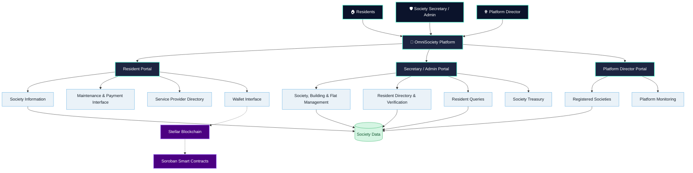

# 🏢 OmniSociety | Smart Residential Society Management

  <strong>One Platform. Smarter Societies. Greater Transparency.</strong>
    
  
    
  
  
  
  
  

> **OmniSociety** is a smart residential society management platform developed by Team ARJUNAA. It aims to simplify housing society operations by bringing residents, society administrators, and platform management together in one digital ecosystem, while exploring blockchain-enabled transparency through Stellar.

---

## 📌 Table of Contents

- [🎥 Project Explanation Video](#-project-explanation-video)
- [🌐 Live Demo](#-live-demo)
- [🚨 Problem Statement](#-problem-statement)
- [💡 Our Solution](#-our-solution)
- [✨ Key Features](#-key-features)
- [🏗️ System Architecture](#️-system-architecture)
- [🔄 How It Works](#-how-it-works)
- [🛠️ Technology Stack](#️-technology-stack)
- [🔗 Blockchain Integration](#-blockchain-integration)
- [🎨 Design Philosophy](#-design-philosophy)
- [🌍 Expected Impact](#-expected-impact)
- [🚀 Future Scope](#-future-scope)
- [👥 Team ARJUNAA](#-team-arjunaa)
- [🔐 Security and Privacy](#-security-and-privacy)
- [⚠️ Disclaimer](#️-disclaimer)

---

## 🎥 Project Explanation Video

Watch the project explanation and walkthrough of **OmniSociety** by Team ARJUNAA.

  
   
  <a href="https://youtu.be/ieTlKXgrirU?feature=shared">
    ▶️ Watch the Project Explanation on YouTube
  </a>

---

## 🌐 Live Demo

Explore the deployed OmniSociety application:

### 🚀 [Launch OmniSociety](https://omnisociety-410808863685.asia-south1.run.app)

The application demonstrates a role-based approach to residential society management through separate resident, secretary/admin, and platform director portals.

*Note: The live application may contain sample or demonstration data. Availability and functionality depend on the deployed version.*

---

## 🚨 Problem Statement

Residential societies manage a wide range of daily activities, including resident records, maintenance payments, complaints, service providers, and communication.

Many communities rely on manual registers, spreadsheets, and multiple messaging groups to handle these responsibilities. This can result in:

- 📄 Scattered records and repetitive paperwork.
- 🏠 Difficulties managing buildings, flats, and resident information.
- 💰 Challenges tracking maintenance dues and payment records.
- 📢 Disorganized communication between residents and administrators.
- 🛠️ Difficulty finding relevant society service providers.
- ⏳ Time-consuming administrative work.
- 🔍 Limited visibility into society-related activities.

**The challenge:** How can residential societies manage their everyday operations through a unified, accessible, and transparent digital platform?

---

## 💡 Our Solution

**OmniSociety** is designed to bring essential housing society operations into one centralized platform.

It connects three major user roles:

- 🏠 **Residents:** Access society information, maintenance details, and service-provider information.
- 🛡️ **Society Secretaries / Administrators:** Manage society records, buildings, flats, resident requests, and queries.
- 🌐 **Platform Directors:** View registered societies and platform-level information.

The project also explores the use of **Stellar Blockchain and Soroban smart contracts** to support traceable digital transactions and maintenance-related workflows.

Our vision is to reduce manual effort, organize society information, and make residential management more convenient for communities across India.

---

## ✨ Key Features

### 🏠 1. Resident Portal

A dedicated interface for residents to access society-related services.

- Resident profile and society information.
- Maintenance details and payment interface.
- Society contact information.
- Service-provider and daily helper directory.
- Wallet-related interface for blockchain interaction.
- Centralized access to resident-facing information.

### 🛡️ 2. Secretary / Admin Portal

A management dashboard for society secretaries and administrators.

- Society profile management.
- Building, floor, and flat information.
- Resident directory.
- Resident joining requests and approval workflows.
- Resident queries and requests.
- Daily helper and service-provider information.
- Society treasury interface.
- Overview of society-related records.

### 🌐 3. Platform Director Portal

A platform-level dashboard for administrative monitoring.

- Registered society information.
- Society listings.
- Overview of residents and secretaries.
- Platform worker information.
- Platform-level monitoring.
- Administrative and security-related settings.

### 💰 4. Digital Maintenance Management

OmniSociety provides an interface for maintenance-related information and payment workflows.

- View maintenance-related details.
- Organize payment information.
- Support digital maintenance workflows.
- Explore blockchain-enabled transaction records.

### 🔗 5. Stellar Blockchain Exploration

The project explores Stellar-based functionality to support transparent and traceable transactions.

- Stellar ecosystem integration.
- Soroban smart-contract technology.
- Wallet connectivity exploration.
- Blockchain-oriented maintenance workflows.

Actual blockchain functionality depends on the integration deployed and successfully tested.

### 🧰 6. Service Provider Directory

- Centralized access to society helpers.
- Organized service-provider information.
- Easier discovery of relevant services within the society.

### 📋 7. Centralized Society Information

- Organized resident and flat records.
- Centralized administrative workflows.
- Reduced dependency on scattered information sources.
- Better access to relevant society information.

---

## 🏗️ System Architecture

OmniSociety follows a role-based architecture that connects the three portals through a central application.

### Architecture Diagram

*Dashed lines represent the intended blockchain integration; they do not independently confirm live, end-to-end transaction execution.*

### Architecture Components

| Component | Responsibility |
|---|---|
| Resident Portal | Resident-facing services and society information |
| Secretary / Admin Portal | Society-level administration |
| Platform Director Portal | Platform-level monitoring |
| Society Data | Society, building, flat, and resident information |
| Stellar | Blockchain network for supported transactions |
| Soroban | Smart-contract functionality |
| Wallet Interface | Wallet-based blockchain interaction |

---

## 🔄 How It Works

1. **Society Setup:** Society information, buildings, and flats are organized through the administration portal.
2. **Resident Onboarding:** Residents submit their joining details through the available workflow.
3. **Verification:** The secretary reviews resident information and joining requests.
4. **Resident Access:** Residents access the relevant society information and available services.
5. **Society Administration:** Administrators manage records, queries, and service-provider information.
6. **Maintenance Workflow:** Maintenance information and payment-related activities are handled through the platform.
7. **Blockchain Workflow:** Where implemented, Stellar and Soroban can support blockchain-based transaction processing and verification.

---

## 🛠️ Technology Stack

| Technology | Purpose |
|---|---|
| Web Application | User interface and society management workflows |
| Stellar | Blockchain ecosystem |
| Soroban | Smart-contract platform |
| Freighter | Wallet integration exploration |
| Cloud Deployment | Hosting the live demonstration |

**Note:** Add the exact frontend framework, backend, database, and AI services after confirming them from the project's source code. This README intentionally avoids guessing technologies that may not be used.

---

## 🔗 Blockchain Integration

OmniSociety explores blockchain as a way to support transparent and verifiable maintenance-related transactions.

### Intended Workflow

1. A user accesses the maintenance payment interface.
2. The application connects to the supported wallet workflow.
3. A transaction can be submitted to the relevant Stellar network when the integration is operational.
4. The transaction can be verified using the network's transaction records.
5. Smart-contract functionality may support additional workflows where implemented.

### Stellar Resources

- 🌌 [Stellar Developer Documentation](https://developers.stellar.org/)
- 📜 [Soroban Smart Contracts](https://developers.stellar.org/docs/build/smart-contracts/overview)
- 👛 [Freighter Wallet](https://www.freighter.app/)

*Do not treat a wallet interface, displayed address, or payment screen alone as proof that a blockchain transaction has executed successfully.*

---

## 🎨 Design Philosophy

OmniSociety aims to provide a clean, structured, and accessible user experience for residents and society administrators.

| Color | Hex Code | Purpose |
|---|---|---|
| Deep Navy | `#0B132B` | Primary interface |
| Mint | `#64FFDA` | Accent and highlights |
| Soft Blue | `#CCD6F6` | Secondary elements |
| Coral | `#FF6B6B` | Alerts and pending items |

The design focuses on clear navigation, role-based interfaces, and practical everyday workflows.

---

## 🌍 Expected Impact

OmniSociety aims to help residential communities:

- 📉 Reduce manual administrative effort.
- 📂 Keep society records organized.
- 🤝 Improve communication between residents and administrators.
- 💰 Make maintenance workflows easier to track.
- 🛠️ Improve access to society service providers.
- 🔍 Support greater visibility into society operations.
- 🔗 Explore transparent and verifiable digital transactions.

Our long-term vision is to make digital society management practical and accessible for residential communities across India.

---

## 🚀 Future Scope

Potential future enhancements include:

- 🤖 AI-assisted complaint categorization and prioritization.
- 🌐 Multilingual complaint submission and communication.
- 🔔 Automated maintenance reminders.
- 🚪 IoT-enabled visitor and smart gate management.
- 📊 Advanced society analytics and reports.
- 🧰 Enhanced service-provider verification.
- 🔐 Improved role-based access and security.
- 🔗 Expanded Stellar and Soroban transaction workflows.
- 📱 Improved accessibility for users with limited technical experience.

These are future possibilities unless explicitly implemented and tested in the current application.

---

## 👥 Team ARJUNAA

**Project:** OmniSociety  
**Team:** ARJUNAA  
**Team Leader:**Mr.Shivraj Shivaji Patil  
**Team Members:**   Ms.Sanika Madhukar Jadhav  
               **   Ms.Vaishnavi Vitthal Shivankar  
               **   Ms.Shreya Sharad Potdar  
               **   Ms.Tanishka Vikrant Patil  
               **   Mr.Deep Manohar Nawsupe  

**Institution:** Annasaheb Dange College of Engineering and Technology (ADCET), Ashta, Maharashtra  
**Domain:** Residential Management | Blockchain | Digital Innovation

Built with curiosity, collaboration, and a vision to solve real-world problems through technology. 💙

---

## 🔐 Security and Privacy

Security and privacy are important considerations for a residential management platform.

- Apply role-based access controls.
- Protect resident information and society records.
- Avoid exposing personal information in public demonstrations.
- Keep private keys, seed phrases, and API secrets out of the repository.
- Avoid storing sensitive personal information on-chain.
- Verify transaction status before marking payments as completed.
- Use appropriate authentication and authorization mechanisms.

---

## ⚠️ Disclaimer

OmniSociety is a student innovation project and demonstration platform.

- Some records displayed in the application may be sample or demonstration data.
- Features shown in the interface may require further integration or testing.
- Blockchain, wallet, AI, and payment capabilities should be considered operational only where verified through actual implementation.
- The architecture diagram illustrates the high-level design and intended integrations; it is not proof that every component is connected end-to-end.

This project is intended for demonstration, learning, and further development.

---

## 🔗 Project Links

- 🚀 **[Live Demo](https://omnisociety-410808863685.asia-south1.run.app)**
- 🎥 **[Project Explanation Video](https://youtu.be/ieTlKXgrirU?feature=shared)**
- 🌌 [Stellar Documentation](https://developers.stellar.org/)
- 📜 [Soroban Documentation](https://developers.stellar.org/docs/build/smart-contracts/overview)
- 👛 [Freighter Wallet](https://www.freighter.app/)

---

  <strong>🏢 OmniSociety — Smarter Society Management for a Connected India</strong>
   
  <em>Designed and developed by Team ARJUNAA</em>

